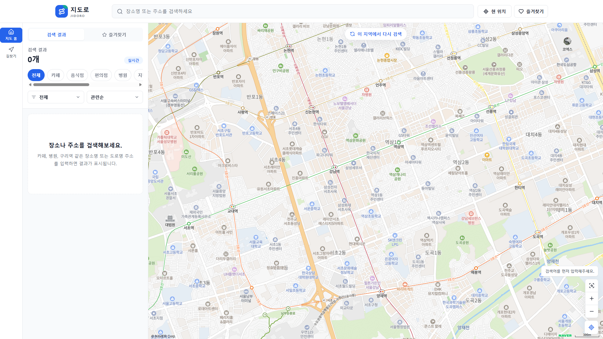

# 지도로 JIDORO



지도로는 지도 위에서 장소와 주소를 검색하고, 결과를 바로 비교한 뒤 길찾기까지 이어갈 수 있는 지도 기반 웹 서비스입니다. 네이버 지도처럼 지도 중심으로 화면을 구성하되, 검색 결과 패널과 상세 정보, 즐겨찾기, 거리뷰, 대중교통 정보를 한 흐름에서 사용할 수 있게 만들었습니다.

## 주요 기능

- 장소명과 주소 검색
- 지도 중심 기준 재검색
- 검색 결과 리스트, 마커 표시, 선택 장소 자동 이동
- 카테고리 필터와 결과 정렬
- 현재 위치 기반 거리 계산
- 장소 상세 정보 패널
- 주소, 전화번호, 공유 문구 복사
- 즐겨찾기 저장과 즐겨찾기 전용 보기
- 네이버 지도 거리뷰 연동
- 자동차, 대중교통, 도보, 자전거 길찾기
- 자동차 경로의 교통 상태별 색상 표시
- 대중교통 추천 경로 후보 표시
- 버스 도착 예정 정보와 지하철역 후보 표시
- 대중교통 상세보기 타임라인
- 모바일 하단 시트형 지도 UI
- 지도로 로고 기반 파비콘

## 사용 기술

- Next.js 14
- React 18
- TypeScript
- Tailwind CSS
- Lucide React Icons
- Naver Maps JavaScript API
- Naver Local Search API
- Naver Cloud Geocoding API
- Naver Cloud Reverse Geocoding API
- Naver Cloud Directions API
- TAGO 버스/지하철 교통 정보 API
- LocalStorage

## 환경 변수

프로젝트 루트에 `.env.local` 파일을 만들고 아래 값을 넣습니다.

```env
NEXT_PUBLIC_NAVER_MAP_CLIENT_ID=
NAVER_CLOUD_MAP_CLIENT_ID=
NAVER_CLOUD_MAP_CLIENT_SECRET=
NAVER_MAP_CLIENT_ID=
NAVER_MAP_CLIENT_SECRET=
TAGO_BUS_ARRIVAL_SERVICE_KEY=
TAGO_BUS_ROUTE_SERVICE_KEY=
TAGO_BUS_STATION_SERVICE_KEY=
TAGO_BUS_LOCATION_SERVICE_KEY=
TAGO_SUBWAY_SERVICE_KEY=
```

## 실행 방법

```bash
npm install
npm run dev
```

브라우저에서 `http://localhost:3000`으로 접속합니다.

## 빌드

```bash
npm run build
npm run start
```

## git 업데이트 명령어

변경사항 확인:

```bash
git status
```

변경 파일 추가:

```bash
git add .
```

커밋:

```bash
git commit -m "Update map search and transit features"
```

원격 저장소에 업로드:

```bash
git push origin main
```

브랜치 이름이 `master`라면 마지막 명령어는 아래처럼 사용합니다.

```bash
git push origin master
```

## 프로젝트 구조

```text
src/app
  api/directions    길찾기 API
  api/places        장소 검색 API
  page.tsx          메인 지도 화면

src/components
  Header.tsx
  SearchPanel.tsx
  PlaceDetailPanel.tsx
  DirectionsPanel.tsx
  NaverMap.tsx

src/lib
  naverLocal.ts
  naverGeocode.ts
  tagoTransit.ts
  placeUtils.ts

src/types
  place.ts
```

## 참고

TAGO API는 네이버 지도처럼 완성된 통합 대중교통 경로 API가 아니라 버스 정류장, 도착 예정, 지하철역 정보를 각각 제공하는 형태입니다. 그래서 지도로에서는 TAGO 응답을 조합해 대중교통 추천 후보와 상세 타임라인 형태로 보여줍니다.
