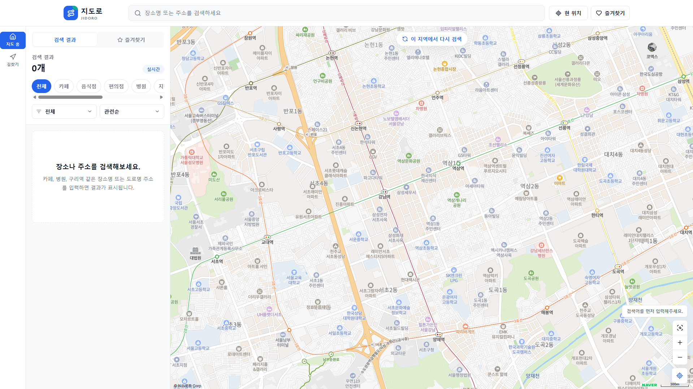

# 지도로 JIDORO



지도로는 지도 위에서 장소와 주소를 검색하고, 결과를 바로 비교한 뒤 길찾기까지 이어갈 수 있는 지도 기반 웹 서비스입니다. 네이버 지도처럼 지도 중심으로 화면을 구성하되, 검색 결과 패널과 상세 정보, 즐겨찾기, 거리뷰, 대중교통 정보를 한 흐름에서 사용할 수 있게 만들었습니다.

## 주요 기능

- 장소명과 주소 검색
- 지도 중심 지역명 기준 재검색 (정확한 지도 영역·반경 제한 검색은 아님)
- 검색 결과 리스트, 마커 표시, 선택 장소 자동 이동
- 카테고리 필터와 결과 정렬
- 현재 위치 기반 거리 계산
- 장소 상세 정보 패널
- 주소, 전화번호, 공유 문구 복사
- 즐겨찾기 저장과 즐겨찾기 전용 보기
- 네이버 지도 거리뷰 연동
- 자동차 실제 경로 조회, 대중교통 주변 정보 조회, 도보·자전거 직선 거리 참고
- 자동차 경로 응답에 포함된 구간의 실제 교통 상태별 색상 표시
- 대중교통 이용 후보 표시 (목적지 연결·환승 경로 미확인)
- 버스 도착 예정 정보와 지하철역 후보 표시
- 대중교통 후보 상세보기
- 모바일 하단 시트형 지도 UI
- 지도로 로고 기반 파비콘

## 사용 기술

- Next.js 14
- React 18
- TypeScript
- Tailwind CSS
- Lucide React Icons
- Naver Maps JavaScript API
- Naver Local Search API
- Naver Cloud Geocoding API
- Naver Cloud Reverse Geocoding API
- Naver Cloud Directions API
- TAGO 버스/지하철 교통 정보 API
- LocalStorage

## 환경 변수

프로젝트 루트에 `.env.local` 파일을 만들고 아래 값을 넣습니다.

```env
NEXT_PUBLIC_NAVER_MAP_CLIENT_ID=
NAVER_CLOUD_MAP_CLIENT_ID=
NAVER_CLOUD_MAP_CLIENT_SECRET=
NAVER_MAP_CLIENT_ID=
NAVER_MAP_CLIENT_SECRET=
TAGO_BUS_ARRIVAL_SERVICE_KEY=
TAGO_BUS_STATION_SERVICE_KEY=
TAGO_SUBWAY_SERVICE_KEY=
```

## 실행 방법

```bash
npm install
npm run dev
```

브라우저에서 `http://localhost:3000`으로 접속합니다.

## 빌드

```bash
npm run build
npm run start
```

## git 업데이트 명령어

변경사항 확인:

```bash
git status
```

변경 파일 추가:

```bash
git add .
```

커밋:

```bash
git commit -m "Update map search and transit features"
```

원격 저장소에 업로드:

```bash
git push origin main
```

브랜치 이름이 `master`라면 마지막 명령어는 아래처럼 사용합니다.

```bash
git push origin master
```

## 프로젝트 구조

```text
src/app
  api/directions    길찾기 API
  api/places        장소 검색 API
  page.tsx          메인 지도 화면

src/components
  Header.tsx
  SearchPanel.tsx
  PlaceDetailPanel.tsx
  DirectionsPanel.tsx
  NaverMap.tsx

src/lib
  naverLocal.ts
  naverGeocode.ts
  tagoTransit.ts
  placeUtils.ts
  serverRequest.ts

src/types
  place.ts
```

## 참고

TAGO API는 통합 대중교통 경로 API가 아닙니다. 버스 정보는 출발지·도착지 주변 정류장 조회 결과이고, 지하철은 입력한 역 이름의 검색 결과입니다. 후보를 실제 연결 경로나 최적 경로로 표시하지 않으며 전체 이동 시간·요금·환승·도착 시각은 미확인으로 표시합니다. 버스 도착 대기 시간은 이동 시간이 아니고, 지하철역 검색은 열차 도착 정보를 제공하지 않습니다.

도보·자전거 모드의 점선과 거리는 두 지점의 직선 참고 정보입니다. 실제 통행 경로와 이동 시간은 제공하지 않습니다. 자동차 API가 실패하면 추정 경로로 바꾸지 않고 오류를 표시합니다. 교통 색상은 Directions 응답의 구간 혼잡도에만 적용하며, 정보가 없는 구간은 기본 자동차 경로 색상으로 남습니다.

## 개선 사항과 운영 주의

- 검색·길찾기 조건 변경 시 이전 요청 취소, 중복 길찾기 제출 방지
- 초기 즐겨찾기 로딩 전에 빈 배열을 저장하지 않도록 처리; 읽지 못한 원본 데이터는 보존
- 같은 장소의 즐겨찾기 중복 방지, 저장 공간·위치 권한 오류 안내
- 모바일 하단 시트·가상 키보드 높이를 고려한 지도 버튼·거리뷰 배치
- 외부 링크는 HTTP(S)만 허용; API 입력 범위와 응답 형태 확인
- 외부 요청별 8초 제한, API 작업 전체 20초 제한; API 키 및 원본 공급자 오류를 브라우저에 노출하지 않음
- 교차 사이트 브라우저 요청 차단은 보조 방어입니다. 공개 API에 대한 직접 호출까지 막지 못하므로 배포 환경의 요청 제한·API 사용량 알림도 별도로 설정해야 합니다.

기존 환경 변수 이름과 즐겨찾기 저장 키(`jidoro.favoritePlaces`)는 유지합니다. 지역 검색은 최대 5개 결과를 반환합니다. TAGO 서비스별 활용 승인과 지도 SDK의 허용 도메인 설정이 필요하며, 서버 비밀 키는 `NEXT_PUBLIC_` 환경 변수에 넣지 않습니다.

이번 수정에서는 빌드·자동 테스트·실제 외부 API 호출 검증을 실행하지 않았습니다.

응답 필드 기준: [네이버 Directions 5](https://api.ncloud-docs.com/docs/en/application-maps-directions5), [TAGO 버스도착정보](https://www.data.go.kr/data/15098530/openapi.do). TAGO `arrtime`은 초 단위로 처리합니다.
